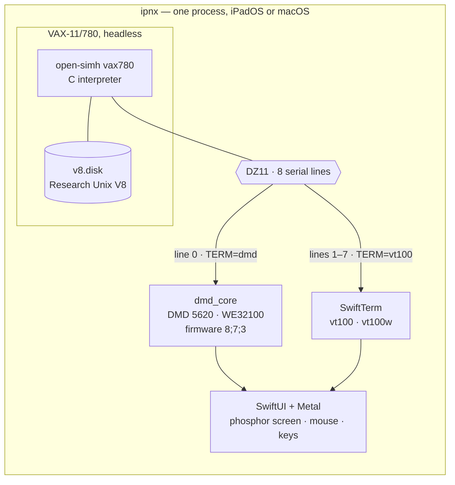

# ipnx

**Research Unix, restored and running.** Genuine Bell Labs Research Unix — Eighth Edition
today, Tenth Edition as the destination — booted on an emulated VAX-11/780 inside a native
**iPadOS and macOS** app, and displayed the way it was meant to be seen: through an emulated
**DMD 5620** terminal, complete with `mux` layers, a three-button mouse, and eventually `sam`.

The goal is not a shell prompt that looks old. It is to reproduce the original Research Unix
environments *faithfully* — the real kernel, the real terminal, the real wire between them —
on hardware you already carry.

> **Status (2026-08-10):** the app is real and works. V8 boots to `login:` in ~25–30 s with
> save/restore instant-on; `mux` and `jim` run on the 5620 on both iPad and Mac; V8 has
> reached the Internet. Track A is complete through A4; Track B — the V10 restoration — is
> under way. Details: [docs/roadmap.md](docs/roadmap.md).

## The name

**ipnx** began as *iPad is not Unix* — in the recursive-acronym tradition of GNU's Not Unix,
and also a plain statement of fact, since "UNIX" is a registered trademark of The Open Group
and an app that runs Research Unix may not call itself one.

It has a second reading, and that is the one that matters: **Intellectual Property is not
Unix.**

Unix spread in the 1970s *because* a 1956 consent decree kept AT&T out of the computer
business — so the system went out to universities with its source for a nominal fee, and a
generation learned to program by reading it. The 1984 divestiture lifted that restriction,
and what followed is the sordid part: System V against BSD, Unix International against the
Open Software Foundation, *USL v. BSDi*, the sale to Novell, the trademark parked at X/Open,
and finally the SCO litigation grinding through the 2000s over copyrights the courts
eventually found SCO had never owned. Unix the *idea* won completely. Unix the *property*
was carved up among companies that, for the most part, no longer make operating systems.

Meanwhile the actual research carried on quietly at the same lab, on the same machines.
Editions 8, 9 and 10 (1985–1989) were never released outside Bell Labs. `/proc`, the stream
I/O system, the file system switch and a network file system all appeared there first — and
then the same people wrote Plan 9. The line didn't stop because it was finished. It stopped
because the company that owned it had become a different kind of company.

The code came back on 7 March 2017, when Alcatel-Lucent/Nokia stated it would not assert
copyright against non-commercial use of Editions 8, 9 and 10. ipnx is what that permission
is *for*: not a museum piece behind glass, but Bell Labs Unix booted, usable, and carried
forward into a world that never got to have it.

## Why full-system emulation

[iSH](https://github.com/ish-app/ish) proved an entire Unix userland can live inside one iOS
app. ipnx takes a different route to a more historic destination: instead of user-mode
syscall translation, it runs **the whole machine** — a VAX-11/780 booting an unmodified
Research Unix kernel, with the screen acting as the portrait CRT of a DMD 5620 connected over
a virtual serial line.

That choice dissolves the platform problems before they start. iOS forbids third-party apps
from spawning processes (no fork/exec) and from generating code at runtime (no JIT). A
full-system emulator needs neither: the Research Unix kernel forks its processes *inside* the
emulated VAX, and both emulator cores are plain ahead-of-time-compiled interpreters — the
same App Store-approved pattern as UTM SE, iDOS 3, and the SIMH-lineage iAltair (on the store
since 2009).

The historically faithful part is that the Blit system genuinely *was* a distributed window
system: a smart terminal running programs downloaded from a headless host over one RS-232
line. The app is simply those two computers and the wire between them.

## Architecture



Two interpreters and a wire, mirroring the real 1985 topology. The app shell is deliberately
**edition-agnostic**: it knows about *machines* (a simulator + a disk image + a wiring), not
about editions, so a future V10 arrives as just another image. Full detail in
[docs/architecture.md](docs/architecture.md); the evidence behind every decision is in
[RESEARCH.md](RESEARCH.md).

## The editions

### ipnx-v8 — Eighth Edition (1985) · *shipping*

The current iteration, and the one that boots today. V8 is the first of the Research editions
to feel modern: `/proc`, Ritchie's streams, the file system switch, Weinberger's network file
system, and the Blit/5620 terminal the whole graphical experience depends on. The app runs it
with save/restore, a real 5620 with two screen sizes, plain glass ttys for quick sessions,
and — since the N track — a working TCP/IP stack reaching the outside world.

### ipnx-v10 — Tenth Edition (1989) · *the restoration*

Tenth Edition survives as **source only** and **has never been booted by anyone**. The plan
is to use the running V8 as the cross-build host for V10's toolchain, userland, kernel and
boot block, then drop `v10.disk` into the same app shell. A world first if it lands:
[docs/v10-restoration.md](docs/v10-restoration.md). V9 is deliberately skipped — what
survives of it is a Sun-3 port with no VAX kernel.

### ipnx-v11 — the edition that never was · *speculative*

There is no Eleventh Edition. There could have been: the Research line was visibly heading
somewhere, and the people who would have written it went off and wrote **Plan 9** and later
**Inferno** instead.

ipnx-v11 is the idea of finishing that sentence — backporting Plan 9 and Inferno components
into a Research Unix that had already invented half of their preconditions. The inspiration
is [Plan 9 from User Space](https://9fans.github.io/plan9port/), which brought Plan 9's tools
*forward* to modern Unix; this would run the same trick *backward*, to the system they grew
out of. Nothing here is committed, and it stays behind V10.

## ipnx-ports

*Planned; nothing built yet.*

A subproject in this repository, in the spirit of the **FreeBSD ports tree**: a per-package
recipe — upstream distfile, patch series, build and install rules — for bringing contemporary
software back to a machine from 1985.

This is harder than a normal port and interesting for exactly that reason. The target has a
K&R C compiler and no ANSI prototypes, 14-byte filenames, no shared libraries, no POSIX, and
an address space that a modern `configure` script would exhaust by itself. So a port is not a
build script; it is a documented act of translation, and the patch series *is* the artifact.
Early candidates are the small, self-contained tools written before ANSI C settled — a
compression utility, `patch`, a decent pager — plus whatever V8 needs to be pleasant to live
in rather than merely to boot.

## Where things stand

| Track | | |
|---|---|---|
| **A0** desktop spike | ✅ | Whole chain proven on a Mac before any Swift ran — [spike-a0-results.md](docs/spike-a0-results.md) |
| **A1** text mode | ✅ | open-simh as a library; V8 to `login:` in ~25–30 s; background save/restore — [a1-notes.md](docs/a1-notes.md) |
| **A2** the Blit experience | ✅ | dmd_core on iOS, Metal phosphor screen, touch-as-mouse; `mux` + `jim` end to end — [a2-notes.md](docs/a2-notes.md) |
| **A3** ship v1 | ✅ | Settings, media management, licences, App Store prep — **plus a native Mac app** sharing every line of code — [a3-notes.md](docs/a3-notes.md) |
| **A4** the screen | ✅ | Two fixed CRT sizes incl. 1152×1024/127 columns, Retina-correct sampling, screen *and* session survive a quit — [screen-size.md](docs/screen-size.md) |
| **B0** ingest path | ✅ | Host↔guest file transfer proven both ways — [media-exchange.md](docs/media-exchange.md) |
| **B0.5** the N track | ◐ | RP07 disk, an Interlan NI1010 modelled for SIMH, and **V8 on the Internet** (`dnsq` resolves real names); netfs remains — [n-track-notes.md](docs/n-track-notes.md) |
| **B0.6** a machine to live in | ○ | Identity, a real user account, host shares at `/n/macos` and `/n/home` — [machine-config.md](docs/machine-config.md) |
| **B1–B4** V10 | ○ | Toolchain → world → kernel → first boot |
| — | ○ | Interface rebuild: tabs per tty, windows by terminal shape, Liquid Glass — [ui-redesign.md](docs/ui-redesign.md) |
| — | ○ | App Store submission (needs the Apple account) — [app-store.md](docs/app-store.md) |

## Repository map

| Path | What it is |
|---|---|
| [app/](app) | The ipnx app — one Swift/SwiftUI source folder, two targets (iPad, Mac) |
| [libsimh/](libsimh) | open-simh `vax780` packaged as an xcframework, with our patches (idling, the NI1010) |
| [libdmd/](libdmd) | dmd_core packaged as an xcframework, with its patches (BREAK, screen size) |
| [tools/](tools) | Probes, harnesses and build helpers — most of them exist because something lied to us once |
| `work/` | Gitignored workbench: disk images, TUHS tarballs, upstream checkouts |
| `ports/` | *(planned)* the ipnx-ports tree |
| [RESEARCH.md](RESEARCH.md) | The original feasibility study — frozen evidence, not a living doc |
| [docs/architecture.md](docs/architecture.md) | Living technical spec |
| [docs/roadmap.md](docs/roadmap.md) | Phases and status for both tracks |
| [docs/licensing.md](docs/licensing.md) | Binding licensing posture for every component |
| [CLAUDE.md](CLAUDE.md) | Working context for AI-assisted sessions — including the hard-won gotchas |

*(The repository directory is still named `ipad-v8`, from before the scope grew past one
device and one edition.)*

## Building and running

Two emulator cores are built as xcframeworks first, then the app. The disk image is **not**
in git — it is produced by the [A0 workbench](docs/spike-a0.md) and must exist at
`work/myv8/rp06v8.golden` before the app build embeds it.

```bash
libsimh/build-xcframework.sh
```

```bash
libdmd/build-xcframework.sh
```

```bash
cd app && xcodebuild -project Edition.xcodeproj -scheme Edition -destination 'platform=iOS Simulator,name=iPad Pro 13-inch (M5)' build
```

```bash
cd app && xcodebuild -project Edition.xcodeproj -scheme EditionMac -destination 'platform=macOS,arch=arm64' build
```

To exercise the whole machine protocol — boot, suspend, save, restore — without the app:

```bash
bash work/verify-libcli.sh
```

## Licensing

Original content in this repository is MIT-licensed ([LICENSE](LICENSE)). The historical
software it runs is **not** covered by that licence: Research Unix Editions 8–10 are
distributable under Nokia/Alcatel-Lucent's 2017 statement permitting **non-commercial** use.
Three consequences are binding, not stylistic — the app is **free**, with no ads and no
purchases; "UNIX" does not appear in its name; and the disk images ship inside the app so it
stays self-contained. The full component table, and a precise account of how far we read
AT&T's GPL-released 5620 ROM source, is in [docs/licensing.md](docs/licensing.md).

## Acknowledgements

This project stands on work by others: **The Unix Heritage Society** (Warren Toomey) for
preserving and hosting the Research Unix archives; **Dan Cross** and **Norman Wilson** for
the V8/V9/V10 materials themselves; **Nokia/Alcatel-Lucent** for the 2017 statement that made
any of this possible; **David du Colombier** and **Tim Newsham** for the V8-on-SIMH recipes;
**Seth Morabito** for the DMD 5620 emulator and firmware preservation; **Dave Dykstra** and
AT&T for releasing the 5620 ROM source in 1994; **Miguel de Icaza** for SwiftTerm; **aiju**
and **aap** for the Blit emulators; and the **open-simh** project.

And, at one remove, the people who wrote the thing in the first place.
