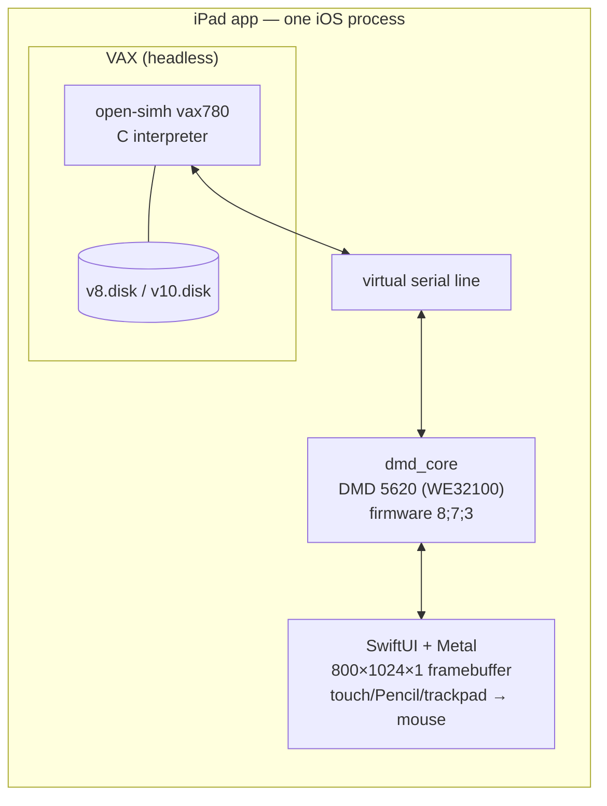

# ipad-v8

**Research Unix on iPad** — Eighth Edition today, Tenth Edition as the destination — running
on an emulated VAX inside a native iPad app, displayed through an emulated **DMD 5620**
("jerq") terminal: the Bell Labs Blit-family graphics terminal, complete with `mux` layers,
a three-button mouse, and eventually `sam`.

> **Status (2026-08-08):** research complete, architecture decided, no code yet.
> Next step: [Phase A0 — the desktop spike](docs/spike-a0.md).

## The idea

[iSH](https://github.com/ish-app/ish) proved an entire Unix userland can live inside a
single iOS app. This project takes a different route to a more historic destination:
instead of user-mode syscall translation, it does **full-system emulation** — a VAX-11/780
booting genuine Bell Labs Research Unix, with the iPad screen acting as the 800×1024
portrait CRT of a DMD 5620 terminal connected over a virtual serial line.

That architectural choice dissolves the iOS platform problems before they start. iOS forbids
third-party apps from spawning processes (no fork/exec) and from generating code at runtime
(no JIT). A full-system emulator needs neither: the Research Unix kernel forks its processes
*inside* the emulated VAX, and both emulator cores are plain ahead-of-time-compiled
interpreters — the same App Store-approved pattern as UTM SE, iDOS 3, and the SIMH-lineage
iAltair (on the store since 2009).

The historically faithful part: the Blit system *was* a distributed window system — a smart
terminal running downloaded programs, talking to a headless host over one RS-232 line. The
app is simply those two computers and the wire between them.

## Architecture

Full detail in [docs/architecture.md](docs/architecture.md).

## The plan

Two tracks, decoupled after a shared desktop spike ([docs/roadmap.md](docs/roadmap.md)):

- **Track A — ship the app with V8 inside.** Every step is proven on desktop: V8 boots under
  SIMH `vax780` via a scripted installer, and Seth Morabito's 5620 emulator core runs V8's
  `mux` today. This track is integration and iPad UX, not research.
- **Track B — the V10 restoration.** Tenth Edition survives as source only and **has never
  been booted by anyone**. The plan: use the running V8 as the cross-build host for V10's
  toolchain, userland, kernel, and boot block — then drop `v10.disk` into the shipping app
  as "Edition 10". A world first if it lands ([docs/v10-restoration.md](docs/v10-restoration.md)).
  V9 is deliberately skipped: what survives of it is a Sun-3 port with no VAX kernel.

## Repository map

| File | What it is |
|---|---|
| [RESEARCH.md](RESEARCH.md) | The full feasibility study — evidence, sources, and the reasoning behind every decision here |
| [docs/architecture.md](docs/architecture.md) | Living technical spec of the app |
| [docs/roadmap.md](docs/roadmap.md) | Track A / Track B phases with status |
| [docs/spike-a0.md](docs/spike-a0.md) | Runbook for the desktop spike (the next concrete step) |
| [docs/v10-restoration.md](docs/v10-restoration.md) | Track B: the V10 bootstrap plan |
| [docs/licensing.md](docs/licensing.md) | Licensing posture for historical software, firmware, and this repo |
| [CLAUDE.md](CLAUDE.md) | Working context for AI-assisted development sessions |

## Building and running

Nothing to build yet. The first executable artifact will come out of the
[A0 desktop spike](docs/spike-a0.md), which validates the whole emulation chain on a Mac
before any iOS code is written.

## Licensing

Original content in this repository is MIT-licensed ([LICENSE](LICENSE)). The historical
software this project runs is **not** covered by that license: Research Unix Editions 8–10
are distributed under Nokia/Alcatel-Lucent's 2017 statement permitting **non-commercial**
use, which is why the eventual app will be free, with no ads or purchases. "UNIX" is a
registered trademark of The Open Group and will not appear in the app's name. Details and
the full component table: [docs/licensing.md](docs/licensing.md).

## Acknowledgements

This project stands on work by others: **The Unix Heritage Society** (Warren Toomey) for
preserving and hosting the Research Unix archives; **Dan Cross** and **Norman Wilson** for
the V8/V9/V10 materials themselves; **Nokia/Alcatel-Lucent** for the 2017 statement that
made distribution possible; **David du Colombier** and **Tim Newsham** for the V8-on-SIMH
recipes; **Seth Morabito** for the DMD 5620 emulator and firmware preservation; **aiju**
and **aap** for the Blit emulators; and the **open-simh** project.
